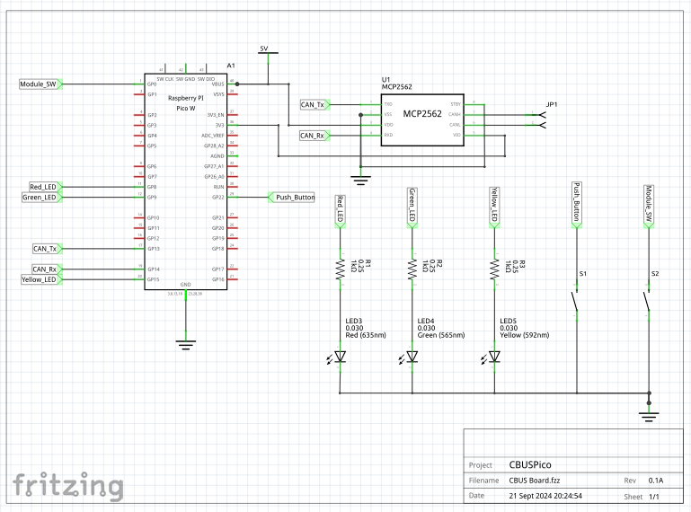
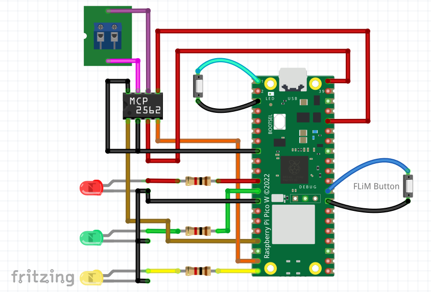

# CBUS&reg; library for RaspberryPi PICO - Simple Example

This repo provides a simple example for using a CBUS Library for the Raspberry PICO, based on the PICO-SDK.

The example provides a simple one-in, one-out module that will operate on a CBUS network with other modules.

The CBUS library source itself is contained in the repo https://github.com/kkimber/CBUSPicoLib.  This source is included into this project as a git submodule.

The CBUS lbirary code is based on existing Arduino CBUS libraries developed by Duncan Greenwood, but with significant refactoring and redesign.

   * https://github.com/MERG-DEV/CBUSLED
   * https://github.com/MERG-DEV/CBUSSWITCH
   * https://github.com/MERG-DEV/CBUSConfig
   * https://github.com/MERG-DEV/CBUS

and the PICO CAN2040 libraries:

   * https://github.com/obdevel/ACAN2040
   * https://github.com/obdevel/CBUSACAN2040

## Project Status

* This project provides a fully working, simple one-in, one-out CBUS module
* The code as provided should work on either a Pico or Pico-W module, it is not designed for a Pico 2
* Internal flash is used for persisent storage, however the library code is designed to support an external I2C EEPROM (but this code is largely untested)

**NOTE:** This is a work in progress and all API's and interfaces are therefore subject to change.

**Build status**

Github is configured to perform continuous integration builds on every check-in, the latest binaries can be downloaded directly from "Github Actions" without needing to download and build from the sources. 

**Static code analysis status**

The code has been analyzed with Coverity for errors.

The current status of the Coverity analysis can be seen here: 

---

## Cloning the repository

This project uses a number of git submodules, so when cloning the repository it is necessary to check out the submodules too.  This can be done by cloning the repository with this command:

    git clone --recurse-submodules https://github.com/kkimber/CBUSPico.git

If this is not done during the initial cloning, the submodules can be initialized at a later date by using this command from the directory where the repository was cloned:

    git submodule update --init --recursive

## Building

The code in github has now been setup to build using the official Pico extension for VSCode.  This should be the easiest way to build and debug the code.  When opening the cloned respository directory in VSCode, VSCode should install the Pico extension, along with other required extensions, before continuing to install other dependencies.

It is still possible to build the code without using the Pico extension, however then the dependencies must be installed manually.  This include:

   * PICO C SDK -Version 1.5.1
   * GCC compiler toolchain
   * ARM GCC compiler toolchain
   * CMake
   * Python 3.x

## Programming a Pico

Once successfully built, installable images will be generated in the build folder.

  * CBUSPico.uf2 - this can be installed on a Pico by putting the Pico into DFU mode by powering the Pico with the BOOTSEL button pressed down.  When in DFU mode, the Pico will appear as a flash drive, and a drag / drop of the uf2 file to that drive will program the Pico.

  * CBUSPico.elf / bin - these files can be used with a suitable debug probe and VSCode to program and debug the code.

## Hardware setup

This example module can be run on any Pico or Pico W (version 1) board as long as it is connected to a suitable CAN transceiver.  The code uses the PIO based CAN2040 soft CAN controller, so no external CAN controller is needed. Simply connect the transceiver to the CAN Tx /Rx pins as indicated below.

The default pin mapping used by CANPico example is follows.

| Pico Pin | Function      |/| Pico Pin | Function      |
|----------|---------------|-|----------|---------------|
| 1        | Module Button | | 40       | VBUS          |
| 2        | GP0           | | 39       | VSYS          |
| 3        | GND           | | 38       | GND           |
| 4        | GP2           | | 37       | 3V3_EN        |
| 5        | GP3           | | 36       | 3V3           |
| 6        | GP4           | | 35       | ADC_VREF      |
| 7        | GP5           | | 34       | GP28          |
| 8        | GND           | | 33       | GND           |
| 9        | GP6           | | 32       | GP27          |
| 10       | GP7           | | 31       | GP26          |
| 11       | Red LED       | | 30       | RUN           |
| 12       | Green LED     | | 29       | Push Button   |
| 13       | GND           | | 28       | GND           |
| 14       | GP10          | | 27       | GP21          |
| 15       | GP11          | | 26       | GP20          |
| 16       | GP12          | | 25       | GP19          |
| 17       | CAN Tx        | | 24       | GP18          |
| 18       | GND           | | 23       | GND           |
| 19       | CAN Rx        | | 22       | GP17          |
| 20       | Yellow LED    | | 21       | GP16          |

\note

   * LED outputs should be connected to ground via 1K resistors.
   * Switch inputs should be connected to ground and have internal pull-up resistors configured in firmware
   * CAN Tx and Rx lines should be connected to a suitable CAN Transceiver, e.g. an MCP2562 as follows

and here is a visual presentation of the required wiring:

## Documentation

Full source documentation is provided to be generated with Doxygen:

https://www.doxygen.nl/

To build the documentation make sure you have Doxygen and GraphViz installed and then build the CMake target "doxygen".

The documentation will be created in the build/html folder.  Open the file index.html in a browser to view the docs.

Pre-build documentation for this repository can be found here:

https://kkimber.github.io/CBUSPico/

## Storage memory layout

Storage for module global configuration variables and node variables can optionally be stored in an external I2C FRAM or EEPROM, or can be located in a the external QSPI flash on the PICO board.

### External FRAM / EEPROM or Flash

If the external FRAM or EEPROM is used the variables are located offset into the FRAM or EEPROM as per "Address" below.

If QSPI flash is used, the last sector of flash is used.  The size of flash on the PICO is defined by PICO_FLASH_SIZE_BYTES, nominally 2MiB in size for current models.  Flash sector size is defined as FLASH_SECTOR_SIZE, which is the minimum size that can be erased, so with a flash size of 2MiB the data will be located at 0x1FF000, with variables located within that sector as per "Address" below.

| Address #           | Length                           | Usage           | EEPROM/FRAM   |
|---------------------|----------------------------------|-----------------|---------------|
| 0x00                | 1                                | FLiM Mode       | Optional      |
| 0x01                | 1                                | CANID           | Optional      |
| 0x02 - 0x03         | 2                                | Node Number     | Optional      |
| 0x04                | 1                                | [spare]         | Optional      |
| 0x05                | 1                                | Reset flag      | Optional      |
| 0x06 - 0x0A         | 4                                | [spare]         | Optional      |
| EE_NVS_START        | EE_NUM_NVS                       | Node Variables  | Optional      |
| EE_EVENTS_START     | EE_MAX_EVENTS * (EE_NUM_EVS + 4) | Events          | No            |

### Flash

| Address #           | Length                           | Usage                      |
|---------------------|----------------------------------|----------------------------|
| 0x000000 - 0x1FEFFF | 0x1FF000                         | Application Image          |
| 0x1FF000 - 0x1FFFFF | 0x1000                           | Flash Storage              |

\attention CBUS&reg; is a registered trademark of Dr. Michael Bolton.  See [CBUS](https://cbus-traincontrol.com/)

