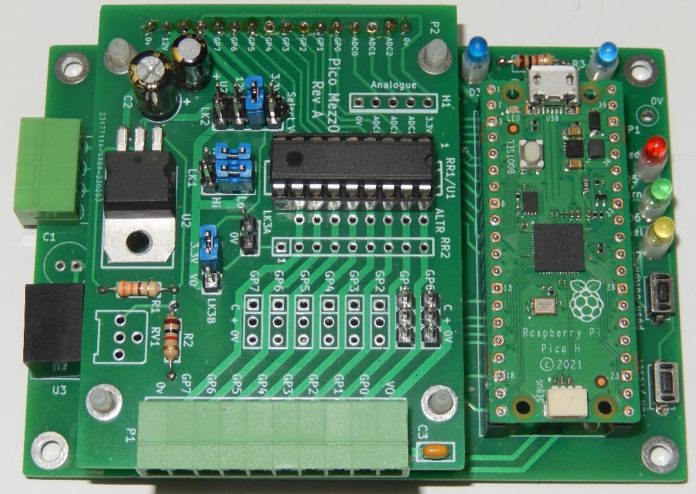
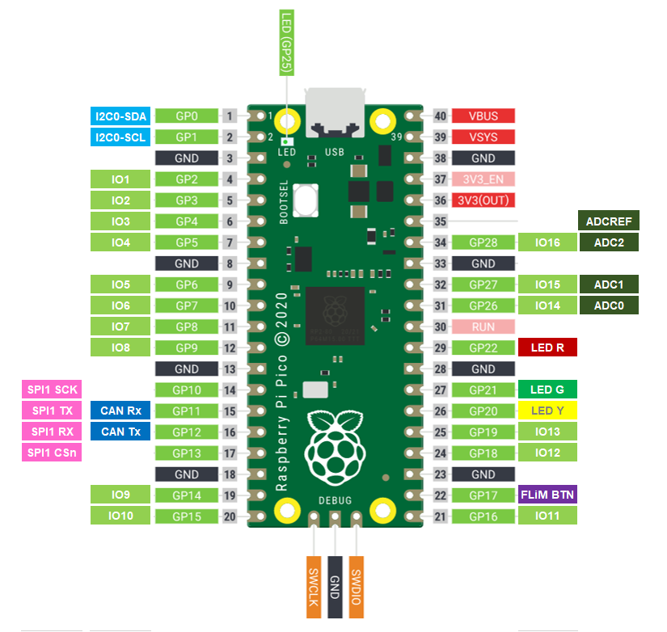

# CBUS library for RaspberryPi PICO

A CBUS Library for the Raspberry PICO, based on the PICO-SDK.

Based on existing MERG Arduino libraries with significant refactoring and clean-up.

   * https://github.com/MERG-DEV/CBUSLED
   * https://github.com/MERG-DEV/CBUSSWITCH
   * https://github.com/MERG-DEV/CBUSConfig
   * https://github.com/MERG-DEV/CBUS

and the PICO CAN2040 libraries:

   * https://github.com/obdevel/ACAN2040
   * https://github.com/obdevel/CBUSACAN2040

## Project Status

* Current status has the example module compiling and it appears functional.
* Use of the external I2C FRAM or EEPROM is not yet implemented, and is largely untested.
* Module based on using the PICO QPSI flash should be functional, but has had very limited testing.

**NOTE:** This is a work in progress and all API's and interfaces are therefore subject to change.

**Build status**

Github is configured to perform continuous integration builds on every check-in, the latest binaries can be downloaded directly from "Github Actions" without needing to download and build the sources. 

**Static code analysis status**

The code has been analyzed with Coverity for errors.

There are currently zero defects identified in the CBUS library code itself, however there are 22 defects identified in the PICO-SDK code that the CBUS library uses.

---

## Building

CANPico requires the RPi Pico-SDK to be installed and configuration files are provided to build with CMake using the standard setup for a pico-sdk based application.

\todo add more build details

## Documentation 

Full source documentation is provided to be generated with Doxygen:

https://www.doxygen.nl/

To build the documentation make sure you have Doxygen and GraphViz installed and then build the CMake target "doxygen".

The documentation will be created in the build/html folder.  Open the file index.html in a browser to view the docs.

## Hardware setup

The CBUSPico library and examples can be run on any Pico board as long as it is connected to a suitable CAN transceiver, however the default pin mapping has been designed to support the PICO02 board designed by Ian Hart.

The default pin mapping used by CANPico is therefore as follows.

The current configuration of the library uses the PIO based CAN2040 libraries, and therefore the PICO2 should be setup so that the 2515 controller chip is not fitted, and the CAN transceiver is jumpered directly to the PICO.

## Storage memory layout

Storage for module global configuration variables and node variables can optionally be in an external I2C FRAM or EEPROM, or can be located in a the external QSPI flash on the PICO board.

### External FRAM / EEPROM or Flash

If the external FRAM or EEPROM is used the variables are located offset into the FRAM or EEPROM as per "Address" below.

If QSPI flash is used, the last sector of flash is used.  The size of flash on the PICO is defined by PICO_FLASH_SIZE_BYTES, nominally 2MiB in size for current models.  Flash sector size is defined as FLASH_SECTOR_SIZE, which is the minimum size that can be erased, so with a flash size of 2MiB the data will be located at 0x1FF000, with variables located within that sector as per "Address" below.

| Address #           | Length                           | Usage           | EEPROM/FRAM   |
|---------------------|----------------------------------|-----------------|----------|
| 0x00                | 1                                | FLiM Mode       | Optional |
| 0x01                | 1                                | CANID           | Optional |
| 0x02 - 0x03         | 2                                | Node Number     | Optional |
| 0x04                | 1                                | [spare]         | Optional |
| 0x05                | 1                                | Reset flag      | Optional |
| 0x06 - 0x0A         | 4                                | [spare]         | Optional |
| EE_NVS_START        | EE_NUM_NVS                       | Node Variables  | Optional |
| EE_EVENTS_START     | EE_MAX_EVENTS * (EE_NUM_EVS + 4) | Events          | No       |

### Flash

| Address #           | Length                           | Usage                      |
|---------------------|----------------------------------|----------------------------|
| 0x000000 - 0x1FEFFF | 0x1FF000                         | Application Image          |
| 0x1FF000 - 0x1FFFFF | 0x1000                           | Flash Storage              |
